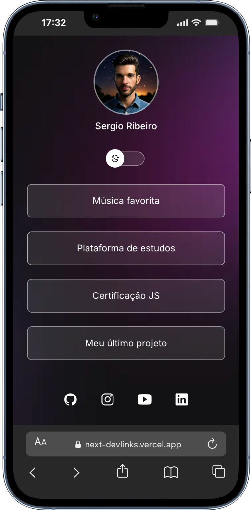
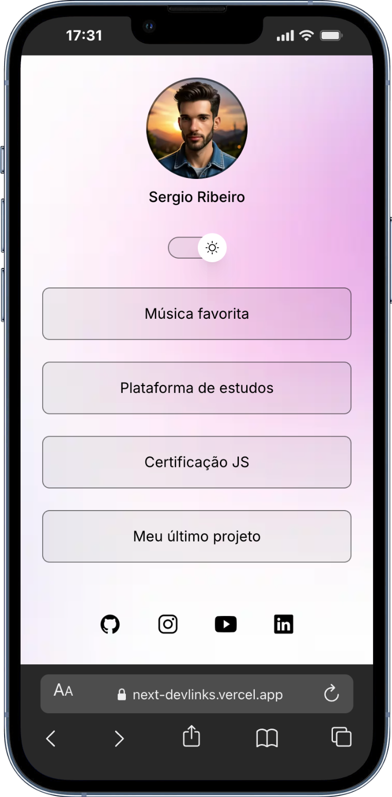
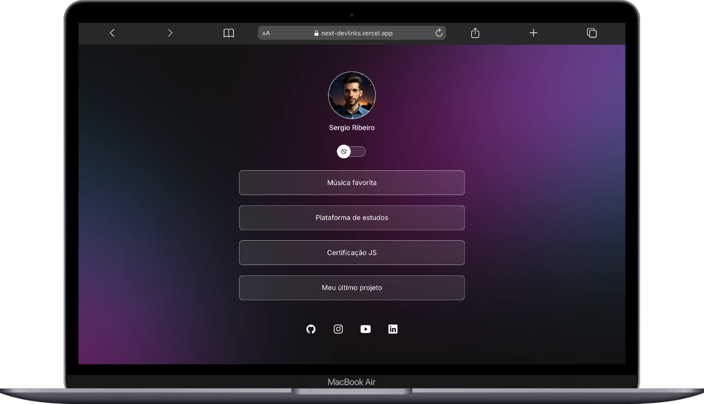
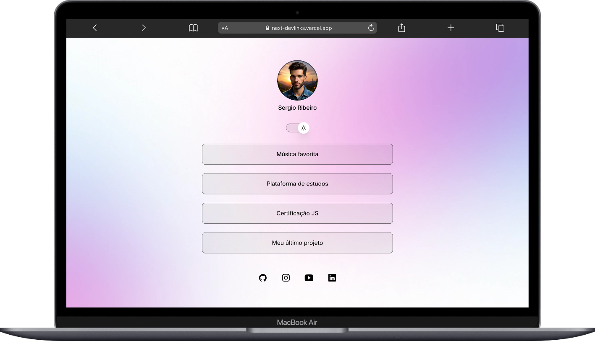

# DevLinks

An application inspired by the **Linktree** concept, created to allow anyone to share their personal links in a simple, elegant, and fully customizable way.  
The project uses **Prismic CMS** for content management, enabling real-time updates without requiring redeploys.

---

## 🚀 Tech Stack
- **Next.js**
- **TailwindCSS**
- **Prismic CMS**

---

## ✨ Features
- Full avatar customization  
- Creation and personalization of general links  
- Dedicated section for social media links  
- Support for both Dark and Light mode  
- Dynamic content managed through Prismic  

---

## 🌐 Live Demo

Access the deployed version:  
https://next-devlinks.vercel.app/

---

## 📌 Best Practices Followed
- Micro commits  
- Semantic commits  
- SEO-optimized  
- Responsive layout  

---

## 🖼️ Screenshots of the Solution

  
  

  
  

